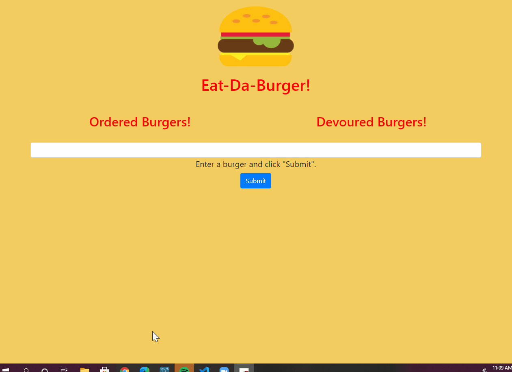

# burger13

## Description 

This application is a burger order logger that utulizes a MySQL database, Node, Express, and Handlebars. This application takes in a burger resturaunt order provided by the user and allows for them them to devour the burger. 

Once the user submits a burger order, the burger appears on the left side of the page. A button is next to the burger order allowing the user to devour the burger they just ordered. The user can order multiple burgers before eating them. Once the burger is devoured it appears on the right side of the page.  

This application connects the front end with user input to the backend where it stores data, retrieves data, and sends it back to the browser based on user specific commands. This application also uses handlebars, which allows you to generate HTML with input objects.  

## Table of Contents 

* [Video](#video)
* [Installation](#installation)
* [Usage](#usage)
* [Credits](#credits)
* [License](#license)
* [Questions](#questions)

## Video

## Installation

Steps to install my project include:
* npm install the dependencies 

## Usage 

* This is a picture of the working application. Burgers to eat are on the left, burgers already devoured are on the right. 

## Credits

All of the code was developed by Dana Kuglin. Information about her GitHub profile and how you can contact her are listed below in the questions section.  

## License

This project is licensed under MIT.

## Questions

GitHub Username: dakuglin
GitHub Profile: (https://github.com/dakuglin)

Please email me with additional questions at dakuglin@gmail.com  